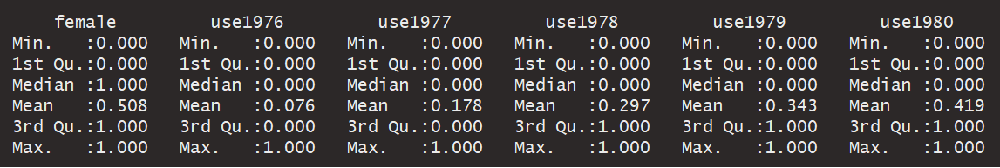
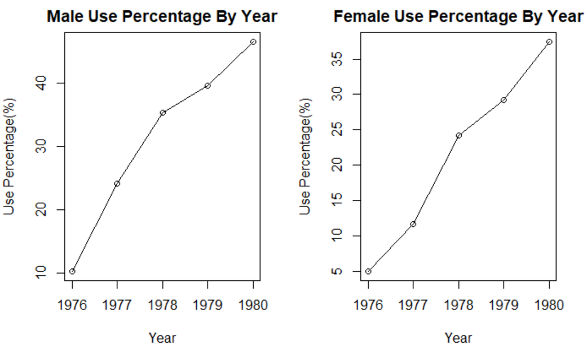
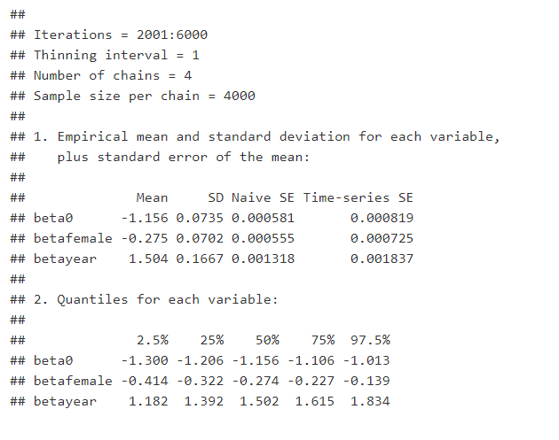
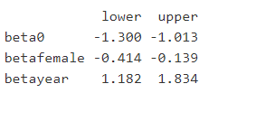
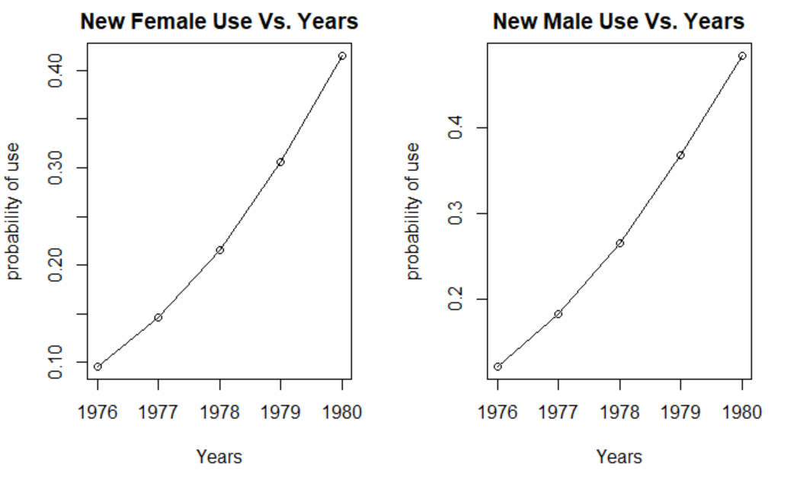
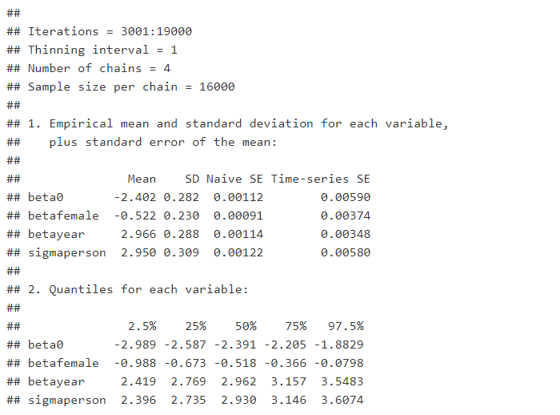

**1. Introduction**  

"Marijuana is a psychoactive drug from the Cannabis plant used for medical or 
recreational purposes. The main psychoactive part of cannabis is tetrahydrocannabinol (THC),
one of the 483 known compounds in the plant, including at least 65 other cannabinoids. 
Cannabis can be used by smoking, vaporizing, within food, or as an extract.Cannabinoids affect 
the central nervous system, which includes the brain and nerves. Cannabinoids are found in the 
highest levels in the leaves and flowers of cannabis. These are the parts of the herb that are 
used to make medicine."   

Some people take cannabis extract by mouth or as a spray to be applied under the tongue for pain 
and symptoms of multiple sclerosis. Some people inhale cannabis for nausea, vomiting, an eye 
disease called glaucoma, and many other conditions, but there is no good scientific evidence to 
support these uses.Some people also use cannabis to feel good. In this case it is used as a 
'recreational drug' and is either taken by mouth or smoked (inhaled)

Use of marijuana is quite common among adoloscents in North America. Recreational marijuana is 
legal for adults in some parts of the USA and in Canada, but illegal for teenagers.  

Although illegal, many teenagers try marijuana and some use it regularly. In Canada, about one 
in six (1/6) students in grades 7 to 12 have reported using cannabis in 2014-2015.It is 
estimated that Canadian adolescents have among the highest rates of cannabis use compared 
to their peers in other developed countries.  Teenage marijuana use in USA is at its 
highest level in 30 years, and today's teens are more likely to use marijuana than tobacco.  

There are many reasons why adoloscents use marijuana. Some of the common reasons why 
adoloscents use marijuana are:  

 
a. To improve or intensify mood: "It's exciting"  
b. To be social: "It helps me enjoy a party"  
c. To cope with stress: "It helps me forget about my problems"   
d. To expand their views: "It helps me understand things differently"  
e. To fit in: "So I won't feel left out"    
f. To break with routine: "I use it because I feel bored"    


Marijuana use by adoloscents causes short term effects like impaired concentration or 
reaction time, poor memory, mood swings, disturbed mental health. Long term use cause severe 
physiological damages like difficulty in breathing due to damaged lungs and psychological effects 
like anxiety, depression, psychosis and schizophrenia.

Source: 
https://en.wikipedia.org/wiki/Cannabis_(drug)  
https://www.canada.ca/en/health-canada/services/publications/drugs-health-products/is-cannabis-safe-use-facts-youth.html#a02  
https://www.aacap.org/AACAP/Families_and_Youth/Facts_for_Families/FFF-Guide/Marijuana-and-Teens-106.aspx  


**2. Data**  

**The dataset is a dataframe of 236 observations(rows) and 6 variables(columns). The variables 
are indicators as their values are binary, indicating either presence of absence of information. 
From the summary of the dataset all variables have minimum = 0 and maximum = 1. The rows 
represent observations about 1 person. Each person therefore has 5 observations for years 1976 
through 1980. There are a total of 1180 observations and each observation is defined by female 
indicator and use-during-the-year indicator**     
```{r out.width = '100%'}

```
  
 
**The mean of variables use1976 through use1980 indicate the percentage of users during 
that year, i.e in 1980, there were 41.9% users.   

The mean of variable female indicates the percentage of females in the survey was about 50.08%.**   

**Two plots of percentage of use versus year: one plot for females and the other for males**  
```{r out.width = '100%'}

```

**3. First Model**  

**A (univariate) Bayesian logistic regression model to explain marijuana use based on the year
and on whether or not the person is female:**

**Part a**  

```{r eval= FALSE}

data {
  dimY <- dim(use)
}
model {
  
  for (i in 1:dimY[1]) {
    for (j in 1:dimY[2]) {
      
      use[i,j] ~ dbern(prob[i,j])
     
      logit(prob[i,j]) <- beta0 + betayear*yearscaled[j] + betafemale*femalecent[i]
      
    }

  }
  
    beta0 ~ dt(0, 0.01, 1) 
    betafemale ~ dt(0, 0.16, 1) 
    betayear ~ dt(0, 0.16, 1)
}

```

**Part b**  

**Summary of the computation details:**  

**Burn-in length:  6000  
Number of chains: 4  
Number of iterations per chain:  4000  
Thinning:  1  
Effective Sample Size of all Parameters:beta0 = 8073; betafemale = 9687;betayear = 7806**  


**Based on the burn-ins and interations from 4 chains used, the below are the detailed results:**

```{r out.width = '100%'}

```

**Part c**  

Posterior Mean of each parameter:  

**beta0: -1.157, betafemale: -0.276, betayear: 1.504**
              

Posterior SD of each parameter:  

**beta0: 0.0722, betafemale: 0.0703, betayear: 0.1644**


95% central posterior interval for each parameter:  

```{r out.width = '100%'}

```

**Part d**  

**Posterior probability that the coecient for the (centered) indicator of 
being female exceeds zero: 0**

**The parameter values are negative. For a given year, the negative value of coefficient
decreases the probability of use. This indicates females are less likely to use marijuana
than males. For males the product of parameter betafemale and the centered female indicator
(betafemale*femalecent), is a positive term, therefore increasing the probability value 
for males. So for any given year, because of the negative betafemale parameter value, 
males are likely to use more marijuana than female for any given year.**  

**Part e**  

**Posterior Expected Probabilities of using marijuana from 1976 through 1980 are:**  
**New Male : 0.123, 0.184, 0.266, 0.368, 0.484**  
**New Female :  0.096, 0.146, 0.216, 0.307, 0.416**  

**Plot of the probabilities versus years**  
```{r out.width = '100%'}

```

**Part f**  

**Plummer's DIC: = 1258**  
**Effective Number of Parametes: = Approx. 3**  
**Actual Paramters: 3 (betayear, betafemale and beta0)**  
**Actual and Effective number of parameters are equal, indicating the JAGS model 
does not shrink the coefficients**  

**4. Second Model**  

**Part a**  

**Second Model JAGS**  

```{r eval = FALSE}
data {
  dimY <- dim(use)
}
model {
  
  for (i in 1:dimY[1]) {
    for (j in 1:dimY[2]) {
      
      use[i,j] ~ dbern(prob[i,j])
      
      logit(prob[i,j]) <- beta0 + betayear*yearscaled[j] + betafemale*femalecent[i] + person[i]
    }
    person[i] ~ dnorm(0, 1/sigmasqperson)
  }
  
  beta0 ~ dt(0, 0.01, 1) 
  betafemale ~ dt(0, 0.16, 1) 
  betayear ~ dt(0, 0.16, 1)
  
  sigmaperson ~ dunif(0,10)
  sigmasqperson <- sigmaperson^2
}
```


**Part b**  

**Summary of the computation details:**  

**Burn-in length:  11000  
Number of chains: 4  
Number of iterations per chain:  16000  
Thinning:  1  
Effective Sample Size of all Parameters:  
beta0 = 2325; betafemale = 3721;  
betayear = 6184; sigmaperson = 2827**  

**Based on the burn-ins and interations from 4 chains used, the below are the detailed results:**

```{r out.width = '100%'}

```

**Part c**  

**Posterior Mean of each parameter:**  

**beta0:-2.402,  betafemale: -0.529,  betayear: 2.970, sigmaperson = 2.956**  

**Posterior SD of each parameter:**  

**beta0: 0.290,  betafemale: 0.229,  betayear: 0.291, sigmaperson = 0.318**

**95% central posterior interval for each parameter:** 

             lower   upper  
beta0       -2.996 -1.8696  
betafemale  -0.988 -0.0824  
betayear     2.412  3.5512  
sigmaperson  2.391  3.6317  

**Part d**  

**Approximation of the value of (Plummer's) DIC and the associated effective number of parameters:**  

**Plummer's DIC : 842  
This is lesser than previous model. The second model with random effect for each person
is better than the first.**  

**The effective number of parameter: Approx 167  
Actual parameters are 239(1 betayear, 1 betafemale, 1 beta0 and 236 random effect coefficients).
There is evident shrinkage of coefficnets in the second model which contributed to 
improving the second model.**  


**5. Conclusions**  

**In Part#2 plot we observed that the percentage of use of marijuana among adoloscents 
had increased over the years. This would therefore indicate that any new adoloscent is 
more likely to use marijuana in the future years. With the first model, we ran a computational 
analysis to validate this assumption and found that a new adoloscent, irrespective of the gender, 
was more likely to use marijuana with each new year. This fact has resulted in higher 
percentage of marijuana use among teens as we progressed from 1976 towards 1980. Our 
analysis is consistent with the information in the introduction section that more teenagers
are using marijuana recently. The use of marijuana by adoloscents has an increasing trend 
till the current date.  

In the first model for analysis, we did not take into account the variablity of a person's marijuana 
use over the years, i.e., in some years the person uses and in others does not use. This random behaviour 
needed to be taken into account to ensure a better accuracy of a new person's use probability in future 
years. By introducing a random effect in the second linear regression model, we observed that the random 
effect did indicate to improve the model's accuracy(smaller DIC and shrinkage of model parameters). In
comparison to the first model, the second model would perform better at predicting the use of marijuana 
in the years beyond 1980. This however was not a part of the analysis**

**6. Appendix**  

```{r setup}
knitr::opts_chunk$set(echo = TRUE)
options(scipen = 1, digits = 3)
library(rjags)
library(R2jags)
library(lattice)
library(MASS)
library(knitr)
library(faraway)
library(ggplot2)
library(statip)
```


```{r}
data = read.csv("marijuanause.csv", header = TRUE)

drops = c("female")
maleuse = subset(data, data$female == 0)
df1 = maleuse[ , !(names(maleuse) %in% drops)]
femaleuse = subset(data, data$female == 1)
df2 = femaleuse[ , !(names(femaleuse) %in% drops)]

years = c(1976:1980)
m_percent = colSums(df1)/nrow(df1)*100
f_percent = colSums(df2)/nrow(df2)*100

par(mfrow = c(1,2))
plot(m_percent~years, main = "Male Use Percentage By Year", 
     xlab="Year", ylab="Use Percentage(%)" )
lines(years,m_percent)
plot(f_percent~years, main = "Female Use Percentage By Year", 
     xlab="Year", ylab="Use Percentage(%)" )
lines(years,f_percent)

```


```{r}
d1 <- list( use = data[,c("use1976","use1977","use1978","use1979","use1980")],
            yearscaled = as.vector(scale(c(1976:1980), scale=2*sd(c(1976:1980)))),
            femalecent = as.vector(scale(c(data$female))))
```

```{r}
inits1 <- list(list(betayear=c(10), beta0 = 10, betafemale = 10),
               list(betayear=c(10), beta0 = -10, betafemale = -10),
               list(betayear=c(-10), beta0 = -10, betafemale = -10),
               list(betayear=c(-10), beta0 = 10, betafemale = -10))
```

```{r }
m1 <- jags.model("model1.bug", d1, inits1, n.chains=4, n.adapt=1000)
```

```{r }
update(m1, 1000) # burn-in
```

```{r}
x1 <- coda.samples(m1, c("beta0","betafemale","betayear"), n.iter= 4000)
```

```{r }
gelman.diag(x1, autoburnin=FALSE)
```

```{r}
effectiveSize(x1)
```

```{r}
plot(x1, smooth=FALSE)
```


```{r}
(sm1 = summary(x1))
```

```{r}
sm1[[1]][,1]
```

Posterior Mean of each parameter:      
```{r}
sm1[[1]][,1]
```
  
Posterior SD of each parameter:  
```{r}
sm1[[1]][,2]
```
  

95% central posterior interval for each parameter:  
```{r}
lower = sm1[[2]][,1]
upper = sm1[[2]][,5]
cbind(lower,upper)
```


```{r}
#Posterior probability that the coecient for the (centered) indicator of 
#being female exceeds zero:
post.samp = as.matrix(x1)
mean(post.samp[,"betafemale"] > 0)
```

```{r warning=FALSE}
ilogit <- function(x) 1/(1+exp(-x))

beta0 = post.samp[,"beta0"]
betayear = post.samp[,"betayear"]
betafemale = post.samp[,"betafemale"]

#posterior mean of beta0, betafemale and betayear. Also applies to new female or 
#male as the same coefficients apply to every person.

post.beta0 = sm1[[1]][1,1]
post.betafemale = sm1[[1]][2,1] 
post.betayear = sm1[[1]][3,1] 

Newfemaleuse1976 = ilogit(post.beta0 + post.betayear*d1$yearscaled[1] 
                          + post.betafemale*(1 - mean(data$female)))
Newmaleuse1976 = ilogit(post.beta0 + post.betayear*d1$yearscaled[1] 
                        + post.betafemale*(0 - mean(data$female)))

Newfemaleuse1977 = ilogit(post.beta0 + post.betayear*d1$yearscaled[2] 
                          + post.betafemale*(1 - mean(data$female)))
Newmaleuse1977 = ilogit(post.beta0 + post.betayear*d1$yearscaled[2] 
                        + post.betafemale*(0 - mean(data$female)))

Newfemaleuse1978 = ilogit(post.beta0 + post.betayear*d1$yearscaled[3] 
                          + post.betafemale*(1 - mean(data$female)))
Newmaleuse1978 = ilogit(post.beta0 + post.betayear*d1$yearscaled[3] 
                        + post.betafemale*(0 - mean(data$female)))

Newfemaleuse1979 = ilogit(post.beta0 + post.betayear*d1$yearscaled[4] 
                          + post.betafemale*(1 - mean(data$female)))
Newmaleuse1979 = ilogit(post.beta0 + post.betayear*d1$yearscaled[4] 
                        + post.betafemale*(0 - mean(data$female)))

Newfemaleuse1980 = ilogit(post.beta0 + post.betayear*d1$yearscaled[5] 
                          + post.betafemale*(1 - mean(data$female)))
Newmaleuse1980 = ilogit(post.beta0 + post.betayear*d1$yearscaled[5] 
                        + post.betafemale*(0 - mean(data$female)))


years = c(1976:1980)
Newusefemale = c(Newfemaleuse1976,Newfemaleuse1977,Newfemaleuse1978,
                 Newfemaleuse1979,Newfemaleuse1980)

Newusemale = c(Newmaleuse1976,Newmaleuse1977,Newmaleuse1978,
               Newmaleuse1979,Newmaleuse1980)

par(mfrow = c (1,2))
plot(years,Newusefemale, main = "New Female Use Vs. Years", 
     ylab = "probability of use", xlab = "Years")
lines(years,Newusefemale)
plot(years,Newusemale, main = "New Male Use Vs. Years", 
     ylab = "probability of use", xlab = "Years")
lines(years,Newusemale)

```

```{r}
dic.samples(m1,2000)
```

```{r}
d2 <- list( use = data[,c("use1976","use1977","use1978","use1979","use1980")],
            yearscaled = as.vector(scale(c(1976:1980), scale=2*sd(c(1976:1980)))),
            femalecent = as.vector(scale(c(data$female))))
```

```{r}
inits2 <- list(list(betayear= 10, beta0 = 10, betafemale = 10, sigmaperson = 1),
               list(betayear= 10, beta0 = -10, betafemale = -10, sigmaperson = 10),
               list(betayear= -10, beta0 = -10, betafemale = -10, sigmaperson = 1),
               list(betayear= -10, beta0 = 10, betafemale = -10, sigmaperson = 10))
```

```{r}
m2 <- jags.model("model2.bug", d2, inits2, n.chains=4, n.adapt=1000)
```

```{r}
update(m2, 2000) # burn-in
```

```{r}
x2 <- coda.samples(m2, c("beta0","betafemale","betayear","sigmaperson"), n.iter= 16000)
```

```{r}
gelman.diag(x2, autoburnin=FALSE)
```


```{r eval=FALSE, include=FALSE}
plot(x2, smooth = FALSE)
```

```{r}
effectiveSize(x2)
```

```{r}
(sm2 = summary(x2))
```

```{r}
#Posterior Mean of each parameter: 

sm2[[1]][,1]
```
  
**Posterior SD of each parameter:**    
```{r}
#Posterior SD of each parameter:
sm2[[1]][,2]
```
  

**95% central posterior interval for each parameter:**  
```{r}
#95% central posterior interval for each parameter: 
lower = sm2[[2]][,1]
upper = sm2[[2]][,5]
cbind(lower,upper)
```

```{r}
#Approximation of the value of (Plummer's) DIC and the associated effective number of
#parameters.

dic.samples(m2,2000)
```

